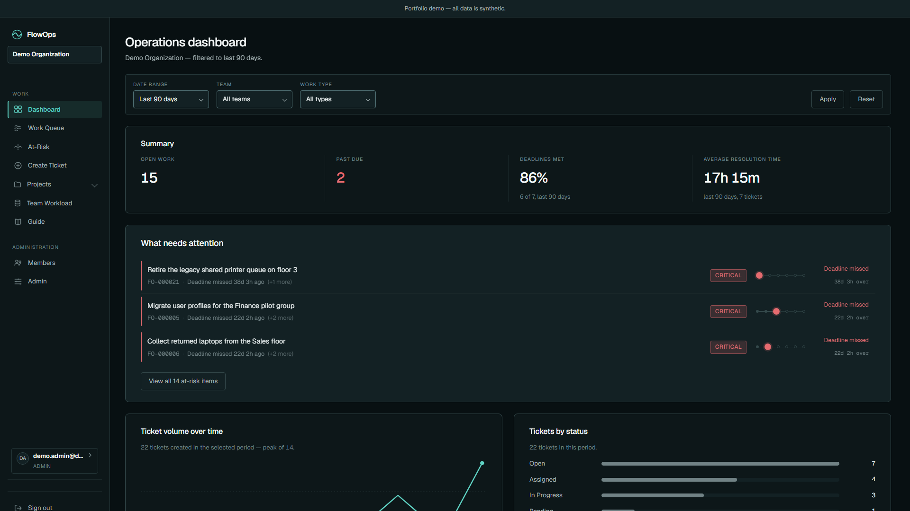
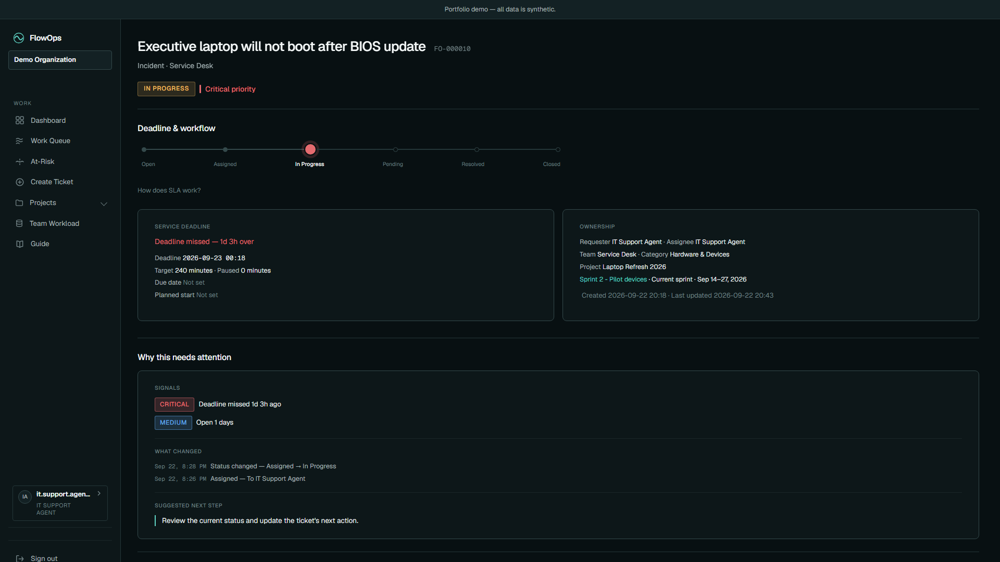
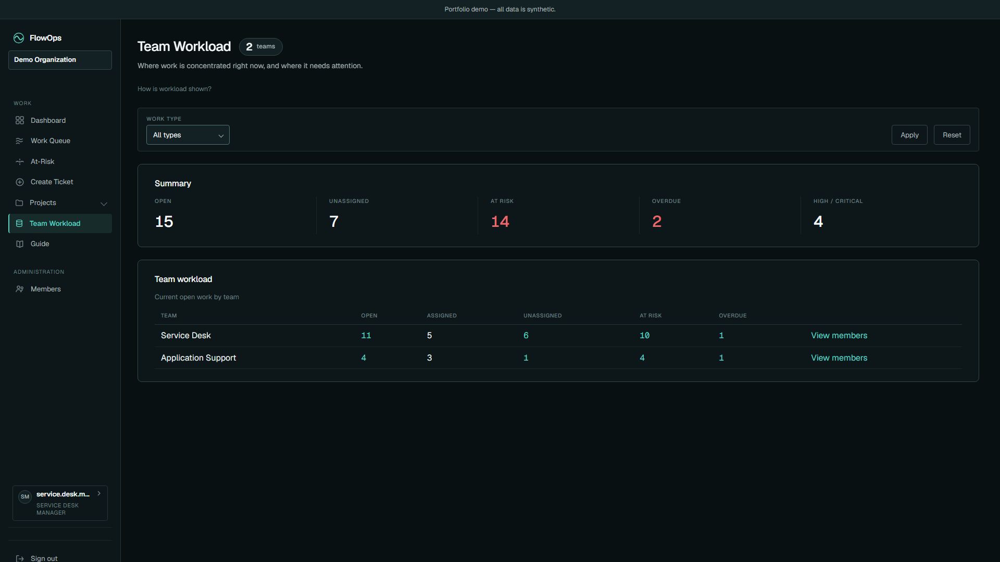
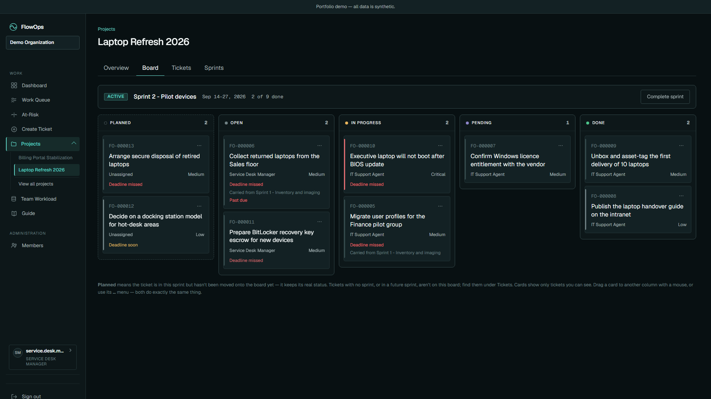
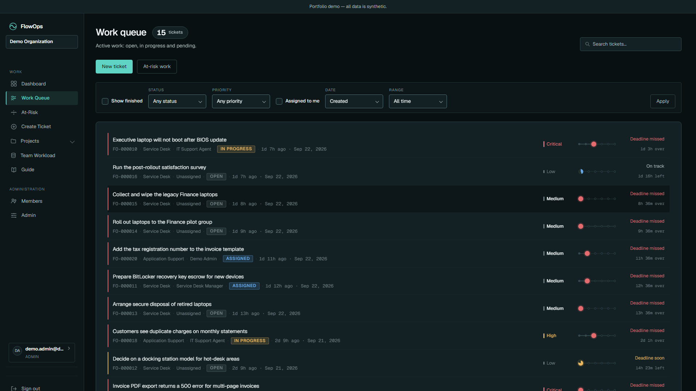

# FlowOps

A multi-tenant IT service-desk platform with a deterministic, explainable "what needs attention"
engine — built as a tested and deployed ASP.NET Core modular monolith.

`ASP.NET Core 10` · `PostgreSQL 17` · `EF Core` · `Razor Pages` · `Docker` · `Render`



---

## What is FlowOps?

FlowOps is an operations/service-desk platform for managing work, incidents, teams, SLAs,
projects, and delivery across an organization. It's built around one idea:

**Work → Workflow → Intelligence → Action**

It doesn't just store tickets in a database and let people filter a list. Every ticket carries a
workflow (Open → Assigned → In Progress → Pending → Resolved → Closed) and an SLA clock. A
deterministic Attention layer continuously evaluates open work against that state and surfaces
what actually needs a human's attention right now — with the evidence behind that decision shown
inline, not hidden behind an opaque flag.

**This isn't just another CRUD ticketing app.** The combination of a deterministic, explainable
attention engine, tenant-aware authorization, and a modular-monolith architecture backed by 1,373
passing tests and a real deployment is the point of this project.

## Why I built it

I wanted to build something closer to a real operational system than a typical portfolio CRUD app:
one with actual authorization boundaries to design, a genuine multi-step workflow to model, and a
business rule (SLA/attention) worth making deterministic and explainable rather than just a status
badge. Concretely, that meant designing multi-tenant organization boundaries and a four-role
authorization model enforced at two layers, modeling a real ticket lifecycle with SLA math that
correctly pauses and resumes, building an attention engine whose every claim is backed by evidence
instead of a black-box score, testing all of it across domain/application/web/browser layers, and
actually deploying it rather than stopping at `dotnet run` on a laptop.

## Key capabilities

- **Multi-tenant organizations** — a user's role is scoped per organization, not global
- **Role-based authorization** — Admin / Manager / Agent / Viewer, enforced server-side
- **Ticket / work management** — full lifecycle, priority, category, team, due dates
- **SLA tracking** — deadlines derived on read, correctly pause while a ticket is Pending
- **Deterministic Attention engine** — 8 named signals, no ML, fully explainable
- **Explainable Attention Brief** — shows *why* a ticket is at risk, not just *that* it is
- **Projects & sprint planning** — weekly sprints, a drag-and-drop board
- **Team Workload** — where open work is concentrated, per team
- **Invitations & membership management** — hashed, expiring tokens; role/team assignment
- **Transactional email integration** — invitations, assignment, and comment notifications
- **In-app Guide** — a static, read-only product guide reachable from the sidebar
- **Operational dashboard** — volume, SLA performance, and attention in one view

## Product walkthrough

**Dashboard** — operational overview of open work, SLA performance, and what needs attention,
filterable by date range, team, and work type.



**Ticket detail** — instead of an unexplained "at risk" flag, FlowOps shows the actual evidence:
which signals fired, what changed, and a suggested next step.



**Team Workload** — where open work is concentrated across teams, and how much of it is at risk,
unassigned, or overdue.



**Sprint board** — a real drag-and-drop board scoped to a project's active sprint, backed by
server-authorized moves (a drop always submits the actual form; nothing is applied optimistically).



**Work queue** — the primary ticket list: filterable by status, priority, and assignment, with SLA
countdown visible on every row.

## Architecture

FlowOps is a **modular monolith** — one deployable, with four internal layers and strict,
one-directional dependencies:

```
┌─────────────────────┐
│    Razor Pages       │   FlowOps.Web
│       (Web)           │   PageModels bind input, call Application, render a view model
└──────────┬────────────┘
           │
┌──────────▼────────────┐
│     Application        │   FlowOps.Application
│  Queries / Services     │   Business workflows, authorization checks, DTOs
└──────────┬────────────┘
           │
┌──────────▼────────────┐
│    Infrastructure       │   FlowOps.Infrastructure
│  EF Core / PostgreSQL    │   The single EF Core DbContext, migrations, identity
└──────────┬────────────┘
           │
┌──────────▼────────────┐
│        Domain           │   FlowOps.Domain
│   Rules / Aggregates      │   Ticket aggregate root, policies, invariants — no dependencies
└─────────────────────────┘
```

A deliberate departure from a "textbook" layered app: **`Application` references
`Infrastructure` directly** — there is no repository/unit-of-work abstraction sitting between
them ([ADR-0002](docs/adr/0002-layered-architecture.md)). At this scale, that indirection buys
testability EF Core's own `InMemory`/`Testcontainers` support already provides, at the cost of a
parallel abstraction to maintain. `Domain` has no outward dependencies at all; `Ticket` is the
aggregate root, and every state-changing rule lives on it or in a policy class beside it.

## The Attention engine

This is the part of FlowOps that isn't just plumbing.

Attention is:
- **Deterministic** — same input, same output, every time
- **Policy-driven** — every rule lives in one class, `AttentionPolicy`
- **Explainable** — every "at risk" verdict comes with the evidence that produced it
- **Read-only** — computed on read from existing ticket state, nothing is pre-materialized
- **Not an AI model** — no scoring, no training data, no black box

The read path:

```
AttentionQueryService
  → SQL candidate prefilter (indexed, narrows to plausible candidates)
  → AttentionPolicy.Evaluate (pure, in-memory, over the candidates)
  → ranking (most urgent first)
  → DTO
  → UI
```

The important engineering guarantee here: **the SQL prefilter must be a provable superset of
every ticket `AttentionPolicy` could classify as at-risk.** The prefilter's job is only to narrow
the table with an index before the real logic runs — it must never silently exclude a ticket the
policy would have flagged. This superset property is enforced by a dedicated test that seeds every
signal and every non-signal condition and asserts the prefilter never misses one.

Instead of a bare "at risk" flag, a ticket's **Explainable Attention Brief** shows the actual
signals that fired:

`SlaBreached` · `SlaAtRisk` · `Overdue` · `UnassignedUrgent` · `Aging` · `Stalled` · `Churn` ·
`Reopened`

## SLA model

`SlaPolicy` is the single source of truth for SLA math — no SLA logic exists anywhere else.
Deadlines are derived on read from a ticket's current state, not pre-computed and stored. A ticket
going `Pending` pauses its SLA clock; the elapsed pending time is added back to the deadline on
resume, so time spent waiting on someone outside the team never counts against the SLA
([ADR-0005](docs/adr/0005-sla-pauses-while-pending.md)). No background scheduler is required to
keep any of this current — because it's derived on read, it's correct at the instant it's viewed.

## Multi-tenancy & authorization

Every user's role (`Admin` / `Manager` / `Agent` / `Viewer`) is a property of their
`OrganizationMembership`, not a global property of the account — the same person can hold a
different role in a different organization. Authorization is centralized and checked at two
layers: an `AuthorizationPolicy` class per concern (tickets, teams, organizations) that both the
`Application` layer and the `Web` layer call, so a page can decide what to render and a service
independently decides what it will actually allow. Analytics and workload views are scoped to the
teams a role can see — a Manager sees their teams, an Agent sees their own workload, a Viewer gets
read-only access to organization-wide analytics with no write path at all.

## Testing

**1,373 tests, across four layers, all passing as of this README:**

| Layer | Count | What it proves |
|---|---:|---|
| Domain | 333 | Aggregate/policy behavior — no database needed |
| Application | 650 | Service + authorization behavior against real PostgreSQL (Testcontainers) |
| Web | 355 | Page rendering, authorization boundaries, form behavior |
| E2E | 35 | Real Chromium browser — actual layout, actual overflow, actual theme application |

## Deployment

```
GitHub repository → Render builds the repo's Dockerfile directly → FlowOps container → Neon PostgreSQL
```

There is no separate CI/CD deploy pipeline — Render is connected directly to this repository and,
on every push to `main`, builds and deploys the image itself from the repo's own multi-stage
`Dockerfile` (dashboard-configured, not a GitHub Actions job). `GitHub Actions` (`ci.yml`) runs on
every push and PR — restore, build, `dotnet format` check, the full test suite, a dependency
vulnerability scan, and a local container build — but does not deploy.

The container runs as a **non-root user**, exposes a `/health` liveness endpoint (and `/health/ready`
for database reachability) that gates every deploy, and applies pending EF Core migrations at
startup behind an explicit flag rather than requiring a manual migration step.

## Transactional email

Transactional email integration with production-ready Resend support; the deployed demo uses a
safe logging provider because no verified sending domain is configured. When a live provider is
configured, FlowOps sends invitation emails, assignment/reassignment notifications, and comment
notifications.

## Engineering decisions

| Decision | Reason |
|---|---|
| Modular monolith, not microservices | One team, one deploy target — the coordination cost of services would buy nothing yet |
| `Application` depends on `Infrastructure` directly | A repository/UoW layer would duplicate what EF Core's own testing support already provides |
| SLA derived on read, no background scheduler | Correctness doesn't depend on a job having run recently — it's always accurate at the moment it's viewed |
| Attention logic lives in one policy class | One place to test, one place to trust — no drift between the UI's story and the actual rule |
| SQL prefilter is a provable superset | Fast at scale (indexed) without ever risking a false negative — verified by a dedicated test |
| Two-layer, tenant-aware authorization | A page and a service both independently enforce the same rule — no page can bypass it by skipping a check |
| Real-browser E2E tests alongside unit/integration tests | Some defects (layout overflow, theme flashing) are only visible to an actual browser |

Full history: [`docs/adr/`](docs/adr/) — 30 accepted architecture decision records, including
several deliberate non-decisions (e.g. [no background scheduler](docs/adr/0006-no-background-scheduler.md)).

## Technology stack

| | |
|---|---|
| **Application** | .NET 10, ASP.NET Core Razor Pages, C# |
| **Data** | PostgreSQL 17 (Neon in production), EF Core |
| **Testing** | xUnit, Testcontainers, Microsoft.Playwright |
| **Infrastructure** | Docker (multi-stage build), Render, Neon PostgreSQL |
| **CI** | GitHub Actions |

## Deliberate limits

FlowOps intentionally does **not** attempt to be a full Jira replacement, a microservice platform,
an AI copilot, a real-time collaboration tool, or a staffing/capacity-optimization system. These
aren't gaps to be filled later so much as scope decisions: the project prioritizes operational
workflow, authorization, deterministic intelligence, explainability, testing, and an actual
deployment over feature breadth. The Attention engine is deterministic by design, not because ML
was out of reach — an explainable rule a support lead can verify is more useful here than a score
they have to trust.

## Documentation

- [Architecture](docs/architecture.md)
- [Domain model](docs/domain-model.md)
- [Database](docs/database.md)
- [Deployment](docs/deployment.md)
- [UI design system](docs/ui/design-system.md)
- [Architecture decision records](docs/adr/)
